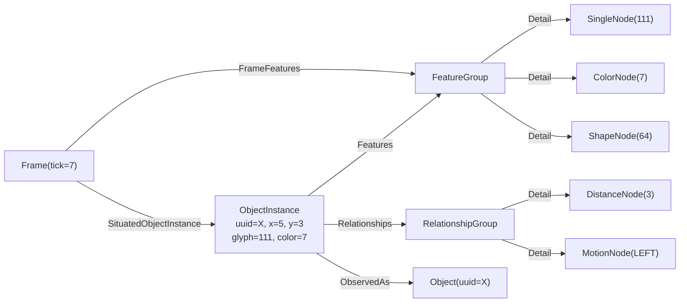
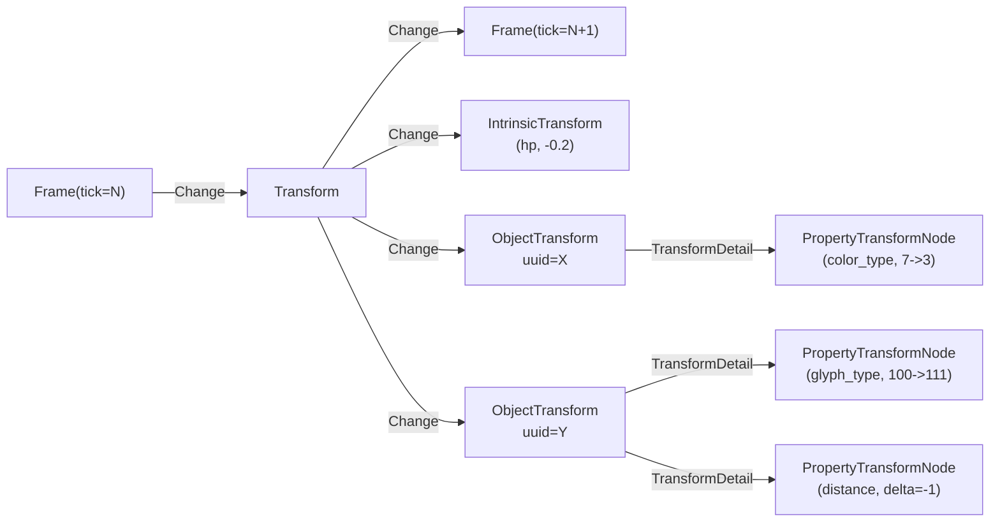
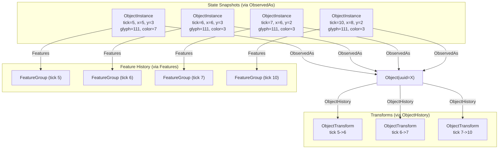

# Object Transform Design

## 1. Overview

This document describes two coupled changes to the ROC pipeline:

1. **Multi-cycle attention**: The attention system runs multiple serial cycles per game
   step, resolving several objects per frame instead of one.
2. **Object transforms**: The system tracks how each object's properties change between
   frames and stores those deltas for prediction.

These changes are coupled because object transforms require the same object to appear in
consecutive frames. With single-object attention and inhibition of return (IOR) shifting
focus away from recently attended locations, the same object rarely appears in consecutive
frames, producing no transforms. Multi-cycle attention solves this by populating each frame
with multiple objects, making same-object matches across frames common.

### Goals

1. **Multiple objects per frame.** Resolve N objects per game step by running the attention
   loop multiple times on the same saliency map with IOR between cycles.
2. **Track all property changes.** Every measurable property of an object is delta'd between
   frames. Properties that turn out to be inconsequential for prediction will be pruned later
   by a separate mechanism.
3. **Enable prediction.** Transforms must be applicable to an object's current state to
   produce a predicted future state, following the existing `Transformable.apply_transform()`
   pattern.
4. **Link transforms to objects.** When an object is re-encountered, its history of past
   transforms must be efficiently retrievable for prediction lookup.
5. **Follow existing patterns.** Use the `Transformable` interface, the `VisualFeature` flat-
   to-graph conversion pattern, the `FeatureGroup` container-with-children pattern, and the
   `Settled` sentinel pattern.

### Non-Goals (This Phase)

- Object classification / abstract class hierarchy
- Pruning inconsequential properties from transforms
- Object appearance/disappearance events
- Resolution feedback into attention (recognized objects influencing subsequent cycles)

---

## 2. Problem Discovery

The original goal was straightforward: track how object properties change between frames
(position, glyph, color, etc.) so the agent can predict future object behavior. The
existing Transformer component already does this for intrinsics (hp, energy, hunger) via
the `Transformable` interface. Extending it to Objects seemed like a natural next step.

However, three cascading constraints revealed that the problem was larger than expected:

### Constraint 1: Same Object Must Appear in Consecutive Frames

The Transformer compares Transformable nodes in frame N against frame N+1. For Objects,
this means the same Object (by identity) must be resolved in both frames. If Object X
appears in frame 5 and Object Y in frame 6, no transform is computed for either.

### Constraint 2: IOR Prevents Same Object in Consecutive Frames

Inhibition of return (IOR) attenuates recently-attended locations, pushing attention to
new areas of the screen. With only one object resolved per frame, IOR makes it unlikely
that the same object is the top saliency peak in consecutive frames. The very mechanism
designed to encourage exploration prevents the system from tracking changes over time.

### Constraint 3: Turn-Based Environment Prevents "Look Before Acting"

One potential solution was to compare objects across non-consecutive frames (frame 5 vs
frame 8, whenever the same Object is re-resolved). This is how humans work: look at A,
then B, then C, then A again -- notice what changed about A since you last looked.

But in NetHack (turn-based), every action advances the game state. Between frame 5 and
frame 8, three actions were taken and three world-state changes occurred. The transform
for Object X would confound "what X did" with "what everything else did while I wasn't
watching." In a continuous environment, the agent could look around without the world
changing. In NetHack, the world changes between every observation.

### Resolution: Multiple Attention Cycles Per Frame

The screen IS static between actions. The agent receives one frame and must decide what
to do. Nothing prevents the attention system from fixating on multiple locations within
that single static frame before committing to an action.

This matches how human vision works: humans make multiple saccades (~3-4 per second) on
a static scene before making a decision. The visual scene does not change between
saccades. Multiple attention cycles per game step restores this property.

With N attention cycles per frame (default 4), each frame contains N resolved objects.
Same-object matches across consecutive frames become common, and transforms can be
computed reliably.

---

## 3. Cognitive Science Background

### Serial vs. Parallel Attention

Research strongly supports that visual attention to objects is fundamentally serial for
identification, with a parallel preattentive stage for feature detection:

| Stage | Mode | What Happens |
|-------|------|-------------|
| Preattentive | Parallel | Feature detection, saliency computation, spatial indexing of ~4 locations |
| Attentive | Serial | Feature binding, object recognition, identity resolution |

Key theories supporting this architecture:

- **Feature Integration Theory** (Treisman & Gelade, 1980): Basic features detected in
  parallel, but binding them into objects requires serial focused attention.
- **Object File Theory** (Kahneman, Treisman & Gibbs, 1992): The visual system creates
  temporary "object files" -- persistent representations updated across frames -- one at a
  time through focused attention. This is what ROC's Object + FeatureGroup model implements.
- **FINST / Multiple Object Tracking** (Pylyshyn, 1988): ~4-5 objects can be tracked
  (indexed spatially) in parallel, but identifying them requires serial attention.
- **Guided Search** (Wolfe, 2021): Parallel priority map guides serial deployment of
  attention at ~20 Hz. Multiple fixations occur per decision cycle.

### Mapping to ROC

ROC's existing architecture aligns well with this research:

- **Feature extractors + saliency map** = preattentive parallel stage
- **ObjectResolver** = attentive serial stage (one object at a time)
- **Object + FeatureGroup** = object files (persistent identity with updated properties)

The missing piece: humans make multiple saccades (fixations) before deciding on an action.
ROC currently makes one fixation per game step. The multi-cycle attention design adds the
multiple-fixation behavior.

### The Turn-Based Problem

In continuous environments, humans can look around freely without the world changing.
In NetHack (turn-based), every action advances the game state. However, the screen IS
static between actions -- the agent receives a frame and must decide what to do. Multiple
attention cycles on that static frame before acting is analogous to multiple saccades
before a decision. The saliency map is built once from the static screen; the attention
loop runs N times on that map with IOR between cycles.

---

## 4. Multi-Cycle Attention

### 4.1 Design Pattern: Settled Sentinel

ROC already has a pattern for "emit an indeterminate number of events, then signal
completion": the `Settled` sentinel. Feature extractors emit features and then emit
`Settled`. VisionAttention collects features until all extractors have settled.

The same pattern applies here: VisionAttention runs N attention cycles, emitting one
`AttentionData` event per cycle on the attention bus, then emits `AttentionSettled` to
signal that all cycles for this frame are complete. This follows the same Settled pattern
that feature extractors use to signal completion. Note: Action does NOT listen for
AttentionSettled -- it synchronizes via the predict bus (see Section 4.5).

This approach was chosen after evaluating five alternatives:

**A. Accumulator/Barrier (EIP Aggregator)**: VisionAttention emits N events on the bus,
a barrier downstream collects all N before forwarding to Sequencer. Problem: N must be
coordinated between emitter and collector -- if the saliency map has fewer than N peaks,
the barrier deadlocks. Requires a new barrier component.

**B. Internal Loop with Single Emission (Encapsulation)**: The loop runs entirely inside
VisionAttention, emitting a single event containing all N focus points. ObjectResolver
receives the batch. Problem: individual cycles are invisible to the bus -- no per-cycle
observability or telemetry. Also, if resolution feedback is later needed to influence
subsequent attention cycles, this pattern cannot support it.

**C. Rx Expand Operator (Recursive Observable)**: Express the iteration as a recursive
reactive stream using RxPY's `expand()`. Each emission feeds back to produce the next
cycle. Problem: `expand` is designed for async operations (API pagination); for synchronous
in-memory saliency computation, it adds subscription overhead without benefit. RxPY's
`expand` is also less battle-tested than RxJS's. Debugging recursive observable chains is
notoriously difficult.

**D. Phase/Epoch (Bulk Synchronous Parallel)**: Restructure the pipeline into explicit
phases separated by barriers -- an "attention phase" followed by an "assembly phase."
Problem: most invasive change. Every component must become phase-aware. Requires a
coordinator component that manages transitions. Breaks the current model where components
are independent and fire-and-forget.

**E. Nested Event Loop / Sub-Bus**: A temporary inner bus handles the attention cycles,
isolated from the main pipeline. Main bus pauses until inner loop completes. Problem:
violates architectural invariant #4 (EventBuses must be class-level attributes, no ad-hoc
creation). RxPY has no lifecycle management for temporary buses.

**Chosen approach: Settled Sentinel** (a hybrid of A and B). The loop runs inside
VisionAttention (like B), but emits per-cycle events on the bus (like A), using the
existing `Settled` pattern for completion signaling. This approach:
- Reuses an established codebase pattern
- Requires no new buses, components, or coordination infrastructure
- Keeps per-cycle events visible on the bus for observability
- Handles fewer-than-N peaks gracefully (loop breaks early, settled still emits)
- Can be upgraded to approach A (full bus-based feedback) later if resolution feedback
  into attention is needed

### 4.2 Attention Loop

```python
# In VisionAttention.do_attention(), after all feature extractors have settled:

saliency_map = self.saliency_map
attenuation = SaliencyAttenuationExpMod.get(default="none")
cycles = Config.get().attention_cycles  # default: 4

for cycle in range(cycles):
    focus_points = saliency_map.get_focus()
    if len(focus_points) == 0:
        break

    self.att_conn.send(
        VisionAttentionData(
            focus_points=focus_points,
            saliency_map=saliency_map,
        )
    )

    # IOR: record attended location, affects next cycle's attenuation
    attenuation.notify_focus(focus_points)

self.att_conn.send(AttentionSettled())
```

Each cycle:
1. Calls `get_focus()` which applies IOR from all previously attended locations (both
   prior frames and prior cycles within this frame), then finds peaks
2. Emits the focus points on the attention bus (ObjectResolver processes the top peak)
3. Calls `notify_focus()` to record the attended location in IOR state

The IOR accumulation between cycles works naturally because both `LinearDeclineAttenuation`
and `ActiveInferenceAttenuation` update their internal state in `notify_focus()` and read
it back in `attenuate()` (called inside `get_focus()`). Within-frame IOR entries persist
into future frames, which is correct -- you attended there recently.

### 4.3 AttentionSettled Sentinel

```python
class AttentionSettled:
    """Sentinel indicating all attention cycles for this frame are complete."""
```

Emitted on the attention bus after the last cycle. Follows the same Settled pattern that
feature extractors use to signal completion. Downstream consumers (reporting, dashboard)
can listen for it to know when attention is done for this frame. Action does NOT listen
for it -- Action synchronizes via the predict bus (see Section 4.5).

### 4.4 ObjectResolver (No Changes to Core Logic)

ObjectResolver already processes one `AttentionData` event at a time. With multi-cycle
attention, it receives N events per frame and resolves each one independently. No changes
to the resolution logic -- it processes each event exactly as it does today:

```python
# Existing code, unchanged:
focus_point = e.data.focus_points.iloc[0]
x, y = XLoc(int(focus_point["x"])), YLoc(int(focus_point["y"]))
features = e.data.saliency_map.get_val(x, y)
fg = FeatureGroup.with_features(features)
# ... resolve, emit ResolvedObject ...
```

The one required change is the prerequisite fix described in Section 4.1 (connecting
FeatureGroups to existing Objects via Features edges).

### 4.5 Pipeline Sequencing: No Custom Gating Needed

The pipeline is naturally synchronized through the predict bus. Action waits for both
`ActionRequest` (from Gymnasium) and a prediction result (from Predict bus) before issuing
`TakeAction`. Since Predict is the last step of the pipeline, waiting for the prediction
result ensures the entire pipeline has completed.

The prediction that gates the current action is from the **previous frame**:
- Frame N-1 closed -> Transformer -> Predict emits prediction
- Frame N arrives, VisionData flows through N attention cycles
- Action receives ActionRequest and the prediction from frame N-1
- By the time the prediction arrives, the current frame's attention cycles have completed
- Action emits TakeAction, which closes frame N

No `AttentionSettled` sentinel, no barriers, no custom synchronization between attention
and action. The predict bus is the natural synchronization point.

**No changes to Action for multi-cycle attention.** Action already waits for prediction
(or will, once the target architecture is implemented). Adding N attention cycles does
not change this -- it just means more objects are attached to the frame before it closes.

The complete pipeline order per game step:

```
1. Gymnasium emits VisionData + ActionRequest
2. Feature extractors process VisionData, emit features + Settled
3. VisionAttention builds saliency map (once all extractors settled)
4. Attention cycle 1: find peak -> emit AttentionData -> ObjectResolver resolves
5. Attention cycle 2: IOR applied -> find next peak -> resolve
   ... (repeat N times)
6. Action receives ActionRequest + prediction from previous frame -> emits TakeAction
7. Sequencer receives TakeAction -> closes frame (all N objects attached) -> emits Frame
8. Transformer computes transforms -> emits TransformResult
9. Predict receives TransformResult -> emits prediction (available for next frame's Action)
```

### 4.6 Configuration

New config field:

```python
attention_cycles: int = 4  # Number of attention cycles per game step
```

Starting with 4, based on cognitive science literature (FINST theory suggests ~4-5 parallel
spatial indexes; Guided Search estimates ~20 attentional deployments per second with
decisions at slower rates).

### 4.7 Downstream Impact: Predict

Predict listens on the **transformer bus** for `TransformResult`, which fires once per
closed frame. It does not fire per object resolution. With multi-cycle attention, the frame
contains N objects when it closes, and the Transformer computes transforms for all
ObjectInstances in the frame against the previous frame's ObjectInstances. Predict receives one
`TransformResult` containing all transforms, exactly as today.

---

## 5. Object Transforms

### 5.1 Prerequisite: Connect FeatureGroups to Objects for Existing Matches

In `ObjectResolver.do_object_resolution()`, after resolving to an existing Object, add:

```python
Features.connect(o, fg)
```

Currently this only happens for new Objects (in `Object.with_features`). For existing
matches, the new FeatureGroup is attached to the Frame but not linked back to the Object.
This fix ensures every FeatureGroup is linked to its Object, enabling:
- Graph traversal: `Frame -> FrameFeatures -> FeatureGroup -> Features -> Object`
- Object history: `Object.feature_groups` returns all observations across all frames

### 5.2 ObjectInstance: The Hub Node (renamed from ObjectState)

`ObjectInstance` is a per-observation record: "I encountered this object type HERE at THIS
TIME with THESE properties." It serves as the **hub** between raw features and persistent
Object identity. Both FeatureGroup (physical features) and RelationshipGroup (relational
features) connect through ObjectInstance to the Object.

Multiple ObjectInstances can reference the same Object (type). For example, 3 orcs on
screen produce 3 ObjectInstances, all linked to the same Object via ObservedAs. Each
instance carries its own position and feature values.

**Position lives on ObjectInstance, not on Object.** Object represents a type (e.g.,
"orc"), which cannot have a single position when multiple orcs exist simultaneously.
The authoritative position for any observation is always on the ObjectInstance.
`Object.last_x`/`Object.last_y` remain for backward compatibility but are not
authoritative -- they reflect the most recent observation only.

ObjectInstance implements `Transformable` and is attached to the Frame via `SituatedObjectInstance`.
It follows the `VisualFeature` pattern: a flat representation of properties that can be
converted to and from graph nodes.

```python
class ObjectInstance(Node, Transformable):
    """Per-observation record of encountering an object type at a specific location and time."""

    object_uuid: ObjectId       # Links back to the Object type identity
    x: XLoc                     # Position of THIS instance at THIS frame
    y: YLoc
    tick: int                   # Frame tick for temporal context

    # Physical feature values (extracted from FeatureGroup's FeatureNodes)
    glyph_type: int | None      # From SingleNode.type
    color_type: int | None      # From ColorNode.type
    shape_type: int | None      # From ShapeNode.type
    flood_size: int | None      # From FloodNode.size (if applicable)
    line_size: int | None       # From LineNode.size (if applicable)

    # Relational feature values (from RelationshipGroup's FeatureNodes)
    delta_old: int | None       # From DeltaNode.old_val
    delta_new: int | None       # From DeltaNode.new_val
    motion_direction: str | None  # From MotionNode.direction
    distance: int | None        # From DistanceNode.size
```

**Construction**: A factory method extracts properties from both groups:

```python
@staticmethod
def from_resolution(
    obj: Object, fg: FeatureGroup, rg: RelationshipGroup,
    x: XLoc, y: YLoc, tick: int,
) -> ObjectInstance:
    """Creates an ObjectInstance by extracting properties from feature and relationship groups."""
    # Walk fg.feature_nodes for PHYSICAL features
    # Walk rg.feature_nodes for RELATIONAL features
    # Similar to _extract_visual_attrs_from_nodes but capturing all properties
    ...
```

**Graph connections (hub topology)**:

```
ObjectInstance ---Features-----> FeatureGroup
ObjectInstance ---Relationships-> RelationshipGroup
ObjectInstance ---ObservedAs----> Object
```

FeatureGroup is attached to the Frame via `FrameFeatures` and ObjectInstance via
`SituatedObjectInstance` (option b -- both on frame, refactor to ObjectInstance-only later).
ObjectInstance is the sole connection point to Object via the `ObservedAs` edge.

**New node: RelationshipGroup**

```python
class RelationshipGroup(Node):
    """A collection of relational feature nodes for one observation."""

    # Connected to relational FeatureNodes via Detail edges
    # (DeltaNode, MotionNode, DistanceNode)
```

RelationshipGroup mirrors FeatureGroup but contains only RELATIONAL features. Currently
these come from feature extractors (per-cell observations). In the future, RelationshipGroup
will also hold inter-object relationships computed between attended objects (see Section 10).

**New edge**:

```python
class Relationships(Edge):
    """Connects an ObjectInstance to its RelationshipGroup."""
    allowed_connections: EdgeConnectionsList = [("ObjectInstance", "RelationshipGroup")]
```

**Existing edge update** -- `Features` already connects `(Object, FeatureGroup)`. Add a new
allowed connection for `(ObjectInstance, FeatureGroup)`:

```python
class Features(Edge):
    """Connects an Object or ObjectInstance to a FeatureGroup."""
    allowed_connections: EdgeConnectionsList = [
        ("Object", "FeatureGroup"),           # existing
        ("ObjectInstance", "FeatureGroup"),    # new
    ]
```

**Transformable implementation**:

```python
def same_transform_type(self, other: Transformable) -> bool:
    """Match by Object identity."""
    return isinstance(other, ObjectInstance) and other.object_uuid == self.object_uuid

def create_transform(self, previous: ObjectInstance) -> ObjectTransform | None:
    """Compute deltas for all properties."""
    changes = _compute_property_changes(current=self, previous=previous)
    if not changes:
        return None
    return ObjectTransform.from_changes(self.object_uuid, changes)

def compatible_transform(self, t: Transform) -> bool:
    return isinstance(t, ObjectTransform)

def apply_transform(self, t: Transform) -> ObjectInstance:
    """Apply transform to predict future state."""
    assert isinstance(t, ObjectTransform)
    return t.apply_to(self)
```

### 5.3 Property Changes

Each property change is represented as a flat dataclass, following the `VisualFeature`
pattern. A property change captures the old value, new value, and a computed delta where
applicable.

#### Continuous Properties (numeric delta is meaningful)

```python
@dataclass
class PositionChange:
    dx: int
    dy: int

@dataclass
class SizeChange:
    """For flood_size or line_size."""
    property_name: str   # "flood_size" or "line_size"
    old_value: int
    new_value: int
    delta: int           # new_value - old_value

@dataclass
class DistanceChange:
    old_value: int
    new_value: int
    delta: int
```

#### Discrete Properties (value substitution, not numeric delta)

```python
@dataclass
class DiscreteChange:
    """For glyph, color, shape -- discrete values where subtraction is not meaningful."""
    property_name: str   # "glyph_type", "color_type", "shape_type"
    old_value: int
    new_value: int

@dataclass
class MotionChange:
    old_direction: str | None
    new_direction: str | None

@dataclass
class DeltaChange:
    """Change in the delta feature (which itself represents a glyph change)."""
    old_pair: tuple[int, int] | None   # (old_val, new_val) from previous frame
    new_pair: tuple[int, int] | None   # (old_val, new_val) from current frame
```

These change types are unified under:

```python
PropertyChange = PositionChange | SizeChange | DistanceChange | DiscreteChange | MotionChange | DeltaChange
```

### 5.4 New Node: ObjectTransform

`ObjectTransform` is a `Transform` subclass that captures all property deltas for one
Object between two consecutive frames. It follows the `FeatureGroup` pattern: a container
node with child nodes for individual property changes.

```python
class ObjectTransform(Transform):
    """All property deltas for one Object instance between two consecutive frames."""

    object_uuid: ObjectId

    # Counts for quick filtering
    num_discrete_changes: int
    num_continuous_changes: int
```

**All property changes are child PropertyTransformNodes**, including position. Position
is represented as two continuous PropertyTransformNodes (`x` and `y`), consistent with
all other properties. No special-case fields on ObjectTransform. This ensures the
prediction model can treat position identically to any other property.

**Child transform nodes** are connected via a new `TransformDetail` edge (mirroring how
`Detail` connects FeatureGroup to FeatureNodes):

```python
class PropertyTransformNode(Node):
    """A single property change within an ObjectTransform."""

    property_name: str       # e.g. "x", "y", "glyph_type", "color_type", "flood_size"
    change_type: str         # "continuous" or "discrete"
    old_value: Any
    new_value: Any
    delta: float | None      # Only for continuous properties

class TransformDetail(Edge):
    """Connects an ObjectTransform to its PropertyTransformNodes."""

    allowed_connections: EdgeConnectionsList = [
        ("ObjectTransform", "PropertyTransformNode"),
    ]
```

**Conversion from flat to graph** follows the VisualFeature.to_nodes() pattern.
PositionChange produces two PropertyTransformNodes (one for x, one for y):

```python
@staticmethod
def from_changes(object_uuid: ObjectId, changes: list[PropertyChange]) -> ObjectTransform:
    """Create an ObjectTransform from a list of property changes."""
    discrete_count = 0
    continuous_count = 0

    for change in changes:
        if isinstance(change, (PositionChange, SizeChange, DistanceChange)):
            continuous_count += 1
        else:
            discrete_count += 1

    ot = ObjectTransform(
        object_uuid=object_uuid,
        num_discrete_changes=discrete_count,
        num_continuous_changes=continuous_count,
    )

    for change in changes:
        nodes = _change_to_nodes(change)
        for node in nodes:
            TransformDetail.connect(ot, node)

    return ot


def _change_to_nodes(change: PropertyChange) -> list[PropertyTransformNode]:
    """Convert a property change to one or more PropertyTransformNodes.

    PositionChange produces two nodes (x and y). All others produce one.
    """
    if isinstance(change, PositionChange):
        return [
            PropertyTransformNode(
                property_name="x", change_type="continuous",
                old_value=None, new_value=None, delta=float(change.dx),
            ),
            PropertyTransformNode(
                property_name="y", change_type="continuous",
                old_value=None, new_value=None, delta=float(change.dy),
            ),
        ]
    elif isinstance(change, (SizeChange, DistanceChange)):
        return [PropertyTransformNode(
            property_name=change.property_name if hasattr(change, 'property_name') else "distance",
            change_type="continuous",
            old_value=change.old_value, new_value=change.new_value, delta=float(change.delta),
        )]
    elif isinstance(change, DiscreteChange):
        return [PropertyTransformNode(
            property_name=change.property_name,
            change_type="discrete",
            old_value=change.old_value, new_value=change.new_value, delta=None,
        )]
    # MotionChange, DeltaChange follow similar patterns
    ...
```

**Connection to Object for prediction lookup**:

```python
class ObjectHistory(Edge):
    """Connects an Object to its historical transforms."""

    allowed_connections: EdgeConnectionsList = [
        ("Object", "ObjectTransform"),
    ]
```

This enables: `Object --ObjectHistory--> [ObjectTransform, ObjectTransform, ...]`

### 5.5 Graph Topology

#### Per-Frame State: One Object's Subgraph

Each attention cycle produces this subgraph for one resolved object:



#### Per-Frame State: Full Frame (4 Objects + Intrinsics)

```mermaid
graph TD
    Frame["Frame(tick=7)"]

    subgraph "Object X (cycle 1)"
        FG_X["FeatureGroup"]
        RG_X["RelationshipGroup"]
        OS_X["ObjectInstance\nuuid=X, x=5, y=3"]
        Obj_X["Object(uuid=X)"]
        OS_X -->|Features| FG_X
        OS_X -->|Relationships| RG_X
        OS_X -->|ObservedAs| Obj_X
    end

    subgraph "Object Y (cycle 2)"
        FG_Y["FeatureGroup"]
        RG_Y["RelationshipGroup"]
        OS_Y["ObjectInstance\nuuid=Y, x=10, y=8"]
        Obj_Y["Object(uuid=Y)"]
        OS_Y -->|Features| FG_Y
        OS_Y -->|Relationships| RG_Y
        OS_Y -->|ObservedAs| Obj_Y
    end

    subgraph "Object Z (cycle 3)"
        FG_Z["FeatureGroup"]
        OS_Z["ObjectInstance\nuuid=Z, x=22, y=1"]
        Obj_Z["Object(uuid=Z)"]
        OS_Z -->|Features| FG_Z
        OS_Z -->|ObservedAs| Obj_Z
    end

    subgraph "Object W (cycle 4)"
        FG_W["FeatureGroup"]
        OS_W["ObjectInstance\nuuid=W, x=15, y=12"]
        Obj_W["Object(uuid=W)"]
        OS_W -->|Features| FG_W
        OS_W -->|ObservedAs| Obj_W
    end

    subgraph "Intrinsics"
        HP["IntrinsicNode(hp, 0.8)"]
        EN["IntrinsicNode(energy, 0.5)"]
    end

    Frame -->|FrameFeatures| FG_X
    Frame -->|SituatedObjectInstance| OS_X
    Frame -->|FrameFeatures| FG_Y
    Frame -->|SituatedObjectInstance| OS_Y
    Frame -->|FrameFeatures| FG_Z
    Frame -->|SituatedObjectInstance| OS_Z
    Frame -->|FrameFeatures| FG_W
    Frame -->|SituatedObjectInstance| OS_W
    Frame -->|FrameAttribute| HP
    Frame -->|FrameAttribute| EN
```



Note: FeatureGroup is attached to Frame via FrameFeatures and ObjectInstance via
SituatedObjectInstance (decision D11, option b). A future refactor may remove the direct
Frame-to-FeatureGroup connection, making ObjectInstance the sole frame attachment point.

#### Transform Between Frames

Objects X and Y appear in both frames; Z and W are new in frame N+1:



#### Object History (for Prediction Lookup)



### 5.6 Applying Transforms (Future Work)

The `Transformable` interface requires `apply_transform()` and `compatible_transform()`.
For this phase, `ObjectInstance` implements these as stubs:

```python
def compatible_transform(self, t: Transform) -> bool:
    return isinstance(t, ObjectTransform)

def apply_transform(self, t: Transform) -> ObjectInstance:
    """Stub: returns a copy of self. Full prediction application is future work."""
    raise NotImplementedError("ObjectInstance.apply_transform is future work")
```

Detailed prediction application -- how to apply transforms to produce predicted states,
how to handle discrete vs continuous properties, and the Bayesian prediction model -- is
out of scope for this phase. See Section 13 (Future Work) for design considerations.

---

## 6. Pipeline Changes Summary

### 6.1 ObjectResolver

Add `Features.connect(o, fg)` for existing Object matches:

```python
# In do_object_resolution, after resolving to existing object:
if o is not None:
    self._record_existing_match(o, x, y, current_tick)
    Features.connect(o, fg)    # <-- NEW: link FeatureGroup to existing Object
else:
    o = self._handle_new_object(fg, x, y, resolution)
```

### 6.2 VisionAttention

Replace single `get_focus()` call with N-cycle loop + AttentionSettled:

```python
# After all feature extractors have settled:
attenuation = SaliencyAttenuationExpMod.get(default="none")
cycles = Config.get().attention_cycles

for cycle in range(cycles):
    focus_points = self.saliency_map.get_focus()
    if len(focus_points) == 0:
        break
    self.att_conn.send(VisionAttentionData(focus_points=focus_points, saliency_map=self.saliency_map))
    attenuation.notify_focus(focus_points)

self.att_conn.send(AttentionSettled())
```

### 6.3 Action

No changes to Action for this design. Action already waits for both `ActionRequest` and
a prediction result from the predict bus before issuing `TakeAction`. The predict bus is
the natural synchronization point -- since Predict is the last pipeline step, waiting for
it ensures the entire pipeline (including all N attention cycles) has completed. See
Section 4.5 for details.

### 6.4 Sequencer

Split features into FeatureGroup (physical) and RelationshipGroup (relational), create
ObjectInstance as the hub, and attach both groups and state to the Frame:

Note: The current Sequencer passes the FeatureGroup through untouched. The new Sequencer
splits features by kind, creates two separate groups, builds the ObjectInstance hub, and
attaches everything to the frame.

Multiple ObjectInstances for the same Object type in a single frame are valid and expected
(e.g., 3 orcs on screen = 3 instances, all referencing the same Object). No de-duplication
is performed. Each attention cycle that resolves an object produces its own ObjectInstance.

```python
def handle_object_resolution_event(self, e: Event[ResolvedObject]) -> None:
    fg = e.data.feature_group  # currently contains ALL features

    # Split features by kind (new behavior -- current Sequencer does not split)
    physical_nodes = [f for f in fg.feature_nodes if f.kind == FeatureKind.PHYSICAL]
    relational_nodes = [f for f in fg.feature_nodes if f.kind == FeatureKind.RELATIONAL]

    # Create separate groups
    feature_group = FeatureGroup.from_nodes(physical_nodes)
    relationship_group = RelationshipGroup.from_nodes(relational_nodes)

    # Create ObjectInstance hub
    from .sequencer import tick as current_tick
    obj_state = ObjectInstance.from_resolution(
        obj=e.data.object,
        fg=feature_group,
        rg=relationship_group,
        x=e.data.x,
        y=e.data.y,
        tick=current_tick,
    )

    # Connect hub topology
    Features.connect(obj_state, feature_group)
    Relationships.connect(obj_state, relationship_group)
    ObservedAs.connect(obj_state, e.data.object)

    # Attach to frame (option b: both FeatureGroup and ObjectInstance)
    FrameFeatures.connect(self.current_frame, feature_group)
    SituatedObjectInstance.connect(self.current_frame, obj_state)
```

### 6.5 Transformer

ObjectInstance implements Transformable, so `_compute_transforms` picks it up
automatically via the existing `_select_transformable_edges` function.

**Ambiguous multi-instance handling**: When multiple ObjectInstances reference the same
Object uuid in either frame (e.g., 3 orcs), the Transformer cannot determine which
instance in frame N corresponds to which in frame N+1 (cross-frame instance tracking
is deferred -- see Section 13). The safe behavior: **skip transforms when the same
Object uuid has more than one ObjectInstance in either frame.** Only compute transforms
for unambiguous cases (exactly 1 instance of that type in both frames).

```python
def _compute_transforms(current_frame, previous_frame):
    current_edges = _select_transformable_edges(current_frame)
    previous_edges = _select_transformable_edges(previous_frame)

    # Count ObjectInstances per Object uuid in each frame
    current_uuid_counts = Counter(
        e.dst.object_uuid for e in current_edges if isinstance(e.dst, ObjectInstance)
    )
    previous_uuid_counts = Counter(
        e.dst.object_uuid for e in previous_edges if isinstance(e.dst, ObjectInstance)
    )

    ret = Transform()
    for ce in current_edges:
        cn = ce.dst
        assert isinstance(cn, Transformable)
        for pe in previous_edges:
            if cn.same_transform_type(pe.dst):
                # Skip ambiguous: multiple instances of same type in either frame
                if isinstance(cn, ObjectInstance):
                    uuid = cn.object_uuid
                    if current_uuid_counts[uuid] > 1 or previous_uuid_counts[uuid] > 1:
                        continue
                t = cn.create_transform(pe.dst)
                if t is not None:
                    Change.connect(ret, t)
                    # Connect ObjectTransform to Object for history
                    if isinstance(t, ObjectTransform):
                        obj = Object.find_one(uuid=t.object_uuid)
                        if obj is not None:
                            ObjectHistory.connect(obj, t)
    return ret
```

This means: the player character "@" (usually unique) always gets transforms. A lone
monster on a level gets transforms. Multiple identical monsters on the same screen get
no per-instance transforms until cross-frame instance tracking is implemented.

### 6.6 Predict

Prediction application (`apply_transform`) is future work. The Transformable interface
requires the method, but for this phase a minimal stub is sufficient. The ObjectInstance
creates and stores transforms; applying them for prediction will be designed separately.
See Section 13 (Future Work) for prediction design considerations.

---

## 7. Edge Schema Summary

New edge types required:

| Edge Type | Allowed Connections | Purpose |
|-----------|-------------------|---------|
| `ObservedAs` | (ObjectInstance, Object) | Links per-frame state to persistent identity |
| `Relationships` | (ObjectInstance, RelationshipGroup) | Links instance to its relational features |
| `FrameFeatures` | (Frame, FeatureGroup) | Attaches physical feature group to frame |
| `SituatedObjectInstance` | (Frame, ObjectInstance) | Attaches object instance to frame |
| `TransformDetail` | (ObjectTransform, PropertyTransformNode) | Links transform to individual property changes |
| `ObjectHistory` | (Object, ObjectTransform) | Links Object to its transform history for prediction |

Existing edge types requiring `allowed_connections` updates:

| Edge Type | New Connection | Purpose |
|-----------|---------------|---------|
| `Features` | Add (ObjectInstance, FeatureGroup) | Links instance to its physical features. Also fix: connect for existing Object matches (Section 5.1) |
| `Detail` | (RelationshipGroup, FeatureNode) | Connects RelationshipGroup to its child features |
| `Change` | NOTE: ObjectTransform extends Transform. Existing `("Transform", "Transform")` in `Change.allowed_connections` already covers this via the node label hierarchy (subclass labels include parent labels). No new entry needed unless label matching is exact-only -- verify during implementation. |

---

## 8. Property Extraction

The `ObjectInstance.from_resolution()` factory method extracts properties from both a
FeatureGroup (physical features) and a RelationshipGroup (relational features). This
mirrors the existing `_extract_visual_attrs_from_nodes()` function but captures all
properties, not just visual display attributes.

The Sequencer splits the original combined FeatureGroup by `FeatureKind` before calling
this method (see Section 6.4). This is new behavior -- the current Sequencer passes the
FeatureGroup through untouched.

```python
@staticmethod
def from_resolution(
    obj: Object, fg: FeatureGroup, rg: RelationshipGroup,
    x: XLoc, y: YLoc, tick: int,
) -> ObjectInstance:
    glyph_type = None
    color_type = None
    shape_type = None
    flood_size = None
    line_size = None
    delta_old = None
    delta_new = None
    motion_direction = None
    distance = None

    # Physical features from FeatureGroup
    for node in fg.feature_nodes:
        match node:
            case SingleNode():
                glyph_type = node.type
            case ColorNode():
                color_type = node.type
            case ShapeNode():
                shape_type = node.type
            case FloodNode():
                flood_size = node.size
            case LineNode():
                line_size = node.size

    # Relational features from RelationshipGroup
    for node in rg.feature_nodes:
        match node:
            case DeltaNode():
                delta_old = node.old_val
                delta_new = node.new_val
            case MotionNode():
                motion_direction = str(node.direction)
            case DistanceNode():
                distance = node.size

    return ObjectInstance(
        object_uuid=obj.uuid,
        x=x, y=y, tick=tick,
        glyph_type=glyph_type,
        color_type=color_type,
        shape_type=shape_type,
        flood_size=flood_size,
        line_size=line_size,
        delta_old=delta_old,
        delta_new=delta_new,
        motion_direction=motion_direction,
        distance=distance,
    )
```

---

## 9. Delta Computation

`ObjectInstance.create_transform()` compares two ObjectInstances for the same Object and
produces property changes:

```python
def _compute_property_changes(current: ObjectInstance, previous: ObjectInstance) -> list[PropertyChange]:
    changes: list[PropertyChange] = []

    # Position (always computed -- continuous)
    dx = int(current.x) - int(previous.x)
    dy = int(current.y) - int(previous.y)
    if dx != 0 or dy != 0:
        changes.append(PositionChange(dx=dx, dy=dy))

    # Discrete properties
    for prop in ["glyph_type", "color_type", "shape_type"]:
        cur_val = getattr(current, prop)
        prev_val = getattr(previous, prop)
        if cur_val is not None and prev_val is not None and cur_val != prev_val:
            changes.append(DiscreteChange(property_name=prop, old_value=prev_val, new_value=cur_val))

    # Continuous size properties
    for prop in ["flood_size", "line_size"]:
        cur_val = getattr(current, prop)
        prev_val = getattr(previous, prop)
        if cur_val is not None and prev_val is not None and cur_val != prev_val:
            changes.append(SizeChange(
                property_name=prop,
                old_value=prev_val,
                new_value=cur_val,
                delta=cur_val - prev_val,
            ))

    # Distance (continuous)
    if current.distance is not None and previous.distance is not None:
        if current.distance != previous.distance:
            changes.append(DistanceChange(
                old_value=previous.distance,
                new_value=current.distance,
                delta=current.distance - previous.distance,
            ))

    # Motion direction (discrete)
    if current.motion_direction != previous.motion_direction:
        changes.append(MotionChange(
            old_direction=previous.motion_direction,
            new_direction=current.motion_direction,
        ))

    # Delta feature (change-of-change)
    cur_pair = (current.delta_old, current.delta_new) if current.delta_old is not None else None
    prev_pair = (previous.delta_old, previous.delta_new) if previous.delta_old is not None else None
    if cur_pair != prev_pair:
        changes.append(DeltaChange(old_pair=prev_pair, new_pair=cur_pair))

    return changes
```

---

## 10. Complete Pipeline Flow (Per Game Step)

```
 Gymnasium
  | sends VisionData, AuditoryData, ProprioceptiveData, ActionRequest
  |
  v
 Feature Extractors (9 total, parallel)
  | each emits Features on perception bus, then Settled
  |
  v
 VisionAttention
  | waits for all extractors to settle
  | builds saliency map (once)
  |
  | Attention Cycle 1:
  |   get_focus() [with IOR from prior frames]
  |   emit AttentionData(peak1) on attention bus
  |   notify_focus(peak1) [IOR: suppress peak1's location]
  |
  | Attention Cycle 2:
  |   get_focus() [IOR now includes peak1]
  |   emit AttentionData(peak2) on attention bus
  |   notify_focus(peak2) [IOR: suppress peak2's location]
  |
  | ... Cycle 3, 4 ...
  |
  | emit AttentionSettled on attention bus
  |
  v
 ObjectResolver (processes each AttentionData independently)
  | Cycle 1: resolve features at peak1 -> Object A -> emit ResolvedObject(A)
  | Cycle 2: resolve features at peak2 -> Object B -> emit ResolvedObject(B)
  | Cycle 3: resolve features at peak3 -> Object C -> emit ResolvedObject(C)
  | Cycle 4: resolve features at peak4 -> Object A -> emit ResolvedObject(A)
  |   (may re-resolve same Object at different location if features match)
  |
  v
 Sequencer (accumulates all events on current frame)
  | attach FeatureGroup(A), ObjectInstance(A) to frame
  | attach FeatureGroup(B), ObjectInstance(B) to frame
  | attach FeatureGroup(C), ObjectInstance(C) to frame
  | attach FeatureGroup(A'), ObjectInstance(A') to frame
  | attach IntrinsicNodes to frame
  |
  v
 Action (gated on ActionRequest AND AttentionSettled)
  | both received -> select action -> emit TakeAction
  |
  v
 Sequencer
  | receives TakeAction -> closes frame -> emits Frame on sequencer bus
  |
  v
 Transformer
  | compares current frame (4 ObjectInstances, IntrinsicNodes) to previous frame
  | for each ObjectInstance in both frames with same object_uuid: create_transform()
  | emits TransformResult (contains all ObjectTransforms + IntrinsicTransforms)
  |
  v
 Predict
  | receives TransformResult
  | finds candidate frames, applies transforms, scores predictions
  | emits predicted Frame (available for next step's action selection)
```

---

## 11. Dashboard Visualization

The new data structures (multi-cycle attention, multiple objects per frame, object
transforms, object history) require dashboard changes so that the developer can monitor
the system frame-by-frame and verify correct behavior.

### 11.1 Data Size Analysis

Multi-cycle attention sends N saliency maps per step instead of 1. Size impact:

| | Raw JSON | gzip estimate |
|---|---|---|
| Current (1 map) | ~32 KB | ~5 KB |
| Proposed (4 maps) | ~128 KB | ~15-20 KB |

Each saliency map is a 21x79 GridData (~32 KB raw). With 4 cycles, the maps are ~95%
identical (IOR only changes ~25-50 cells per cycle out of 1,659). gzip exploits this:
the repeated content compresses to near-zero. At 1 step/second, the additional ~10-15 KB/s
gzipped bandwidth is negligible for localhost/LAN. Parquet storage (DuckLake) handles
correlated data similarly well.

**No special compression needed** beyond existing gzip (HTTP) and Parquet (DuckLake). If
N increases significantly in the future, a "1 full map + N-1 diffs" approach can be adopted
as an optimization.

### 11.2 Visual Attention Panel (Enhanced)

**Current**: Single saliency map + single focus points table + attenuation details.

**New**: A summary table showing all N cycles at a glance, plus a stepper to drill into
each cycle's full saliency map and attenuation details.

```
+-------------------------------------------------------+
| Attention Cycles Summary                               |
+-------------------------------------------------------+
|  # | Pre-IOR Peak   | Post-IOR Peak  | Focused Point  |
|  1 | (10,5) 0.95    | (10,5) 0.95    | (10,5) 0.95   |
|  2 | (10,5) 0.95    | (15,8) 0.82    | (15,8) 0.82   |
|  3 | (10,5) 0.95    | (22,1) 0.71    | (22,1) 0.71   |
|  4 | (10,5) 0.95    | (18,3) 0.68    | (18,3) 0.68   |
+-------------------------------------------------------+
| Cycle Detail: [1] [2] [3] [4]                         |
+-------------------------------------------------------+
| +---------------------------+ +---------------------+ |
| |                           | | Focus Point         | |
| |    Saliency Map           | |   x: 15  y: 8      | |
| |    (cycle 2 state)        | |   strength: 0.82    | |
| |    with focus point       | |                     | |
| |    highlighted             | | Attenuation         | |
| |                           | |   history: 4 entries | |
| |                           | |   max_penalty: 0.7  | |
| +---------------------------+ +---------------------+ |
+-------------------------------------------------------+
```

The summary table shows three columns per cycle: the peak before IOR was applied (what
would have been selected without attenuation), the peak after IOR (what the attenuated
map selected), and the final focused point (the actual location attended). All three
points are clickable to highlight on the game screen and saliency map. When pre-IOR and
post-IOR peaks differ, this is the direct evidence that IOR shifted attention.

Below the summary table, a stepper (Mantine `SegmentedControl`) selects which cycle's
full saliency map and attenuation details to display. The existing `SaliencyMap` and
`AttenuationPanel` components render whichever cycle is selected.

The backend emits `saliency_cycles: list[GridData]` (one per cycle) and per-cycle
attenuation metadata including pre-IOR peak, post-IOR peak, and focused point.

### 11.3 Object Resolution Panel (Enhanced)

**Current**: Single resolution inspector showing one resolution decision per step.

**New**: A summary table showing all N resolution outcomes at a glance, plus a stepper
to drill into each cycle's full candidate evaluation and resolution cards (same layout
as the existing inspector, just with a stepper to switch between cycles).

```
+-------------------------------------------------------+
| Resolution Summary                                     |
+-------------------------------------------------------+
|  # | Outcome | Object          | Location | Candidates|
|  1 | MATCH   | [@ WHT] obj:-42 | (10,5)   | 3         |
|  2 | MATCH   | [d RED] obj:-87 | (15,8)   | 5         |
|  3 | NEW     | [. GRY] obj:-99 | (22,1)   | 0         |
|  4 | MATCH   | [$ YEL] obj:-13 | (18,3)   | 2         |
+-------------------------------------------------------+
| Resolution Detail: [1] [2] [3] [4]                    |
+-------------------------------------------------------+
| Outcome: MATCH                    Location: (15, 8)   |
| +-------------------------+ +---------------------+   |
| | Observed    | Matched   | | Candidates          |   |
| | glyph: 100 | glyph: 100| | [d RED] obj:-87 d=0 |   |
| | color: RED  | color: RED| | [d BRN] obj:-44 d=1 |   |
| | shape: d   | shape: d  | | [j RED] obj:-55 d=2 |   |
| +-------------------------+ | [d GRN] obj:-61 d=2 |   |
| Features: SingleNode(100), | | [o RED] obj:-72 d=3 |   |
|   ColorNode(1), ShapeNode(d)| +---------------------+ |
+-------------------------------------------------------+
```

The summary table shows each cycle's outcome with a visual representation of the
resolved object -- a glyph badge rendered with the object's actual color (same as the
existing `GlyphBadge` component). Object references in the summary table are clickable
to open the Object Modal. Location points are clickable to highlight on the game screen.

The candidates table in the detail view also shows glyph badges with colors for each
candidate object, so the developer can visually compare what the resolver chose vs
what it rejected.

Below the summary, the stepper selects which cycle's full resolution detail to display.
The detail view uses the same two-card layout as the current `ResolutionInspector`
(observed-vs-matched comparison card + candidates card), unchanged except for receiving
per-cycle data.

The backend emits `resolution_cycles: list[ResolutionMetrics]` instead of a single
`resolution_metrics`.

### 11.4 Sequence Panel (Enhanced)

**Current**: Shows tick, one object, intrinsics with progress bars.

**New**: Shows all nodes in the current frame -- N ObjectInstances + IntrinsicNodes -- in
a unified textual table format. All frame information is represented the same way:
rows with name, value, and metadata. No bar graphs; intrinsics are textual rows like
everything else.

```
+-------------------------------------------------------+
| Frame: tick=7  |  4 objects  |  8 intrinsics          |
+-------------------------------------------------------+
| Objects:                                               |
|   # | Glyph | Pos    | Color  | Matched | Resolves   |
|   1 | @     | (10,5) | WHITE  | yes     | 42         |
|   2 | d     | (15,8) | RED    | yes     | 7          |
|   3 | .     | (22,1) | GREY   | no (new)| 1          |
|   4 | $     | (18,3) | YELLOW | yes     | 15         |
+-------------------------------------------------------+
| Intrinsics:                                            |
|   Name   | Raw  | Normalized | Matched                |
|   hp     | 15   | 0.80       | yes                    |
|   hpmax  | 18   | 1.00       | yes                    |
|   energy | 10   | 0.50       | yes                    |
|   hunger | 0    | 1.00       | yes                    |
+-------------------------------------------------------+
```

All rows use the same textual table style. Object rows show glyph badges with the
object's actual color. Intrinsic rows show raw value, normalized value, and whether the
intrinsic was also in the previous frame (for transform eligibility). The "Matched"
column applies to both objects and intrinsics -- it indicates whether a transform was
computed for that entity.

Object rows are clickable -- clicking opens the Object Modal (Section 10.6). Location
values are clickable to highlight on the game screen.

### 11.5 Transition Panel (Redesigned)

**Current**: Shows intrinsic transforms only (type, name, delta).

**New**: Three-column layout aligning previous frame, current frame, and deltas. Objects
and intrinsics are row-aligned so the same entity appears on the same row across columns.
Objects not present in one frame show "--" in that column.

```
+-------------------------------------------------------+
| Previous Frame (tick=6)  | Current Frame (tick=7)     |
+-------------------------------------------------------+
| Objects:                                               |
|  Prev         | Current       | Delta                  |
|  @ (9,5) WHT  | @ (10,5) WHT  | x: +1, y: 0            |
|  d (14,7) RED | d (15,8) RED  | x: +1, y: +1           |
|  --            | . (22,1) GREY | (new)                  |
|  $ (18,3) YEL | $ (18,3) YEL  | (no change)            |
|  o (20,4) GREY| --             | (gone)                 |
+-------------------------------------------------------+
| Intrinsics:                                            |
|  Prev         | Current       | Delta                  |
|  hp: 0.90     | hp: 0.80      | -0.10                  |
|  energy: 0.50 | energy: 0.50  | (no change)            |
+-------------------------------------------------------+
```

Row alignment is the key feature: the same object (by uuid) is on the same row in both
columns. Matched rows show property deltas on the right. New objects (current only) and
gone objects (previous only) are clearly marked. Cells with changes are highlighted with
diff coloring (same pattern as ResolutionInspector: green for same, red/yellow for
changed).

Object references in this panel are clickable (opens Object Modal). Step references in
the header are clickable (jumps to that step).

### 11.6 Object Modal (New)

Clicking any object reference anywhere in the dashboard opens a modal showing that
object's full information and history. Entry points include: Sequence Panel object rows,
Transition Panel object cells, All Objects table rows, Resolution Inspector matched
object, and any future panel that displays an object.

This requires a shared `<ObjectLink>` component used throughout the dashboard. ObjectLink
renders a glyph badge (or object ID) that is clickable and opens the modal.

```
+-------------------------------------------------------+
| Object: @ (uuid: gentle-alice-smith-ab3f)       [X]  |
+-------------------------------------------------------+
| Physical:                                              |
|   Glyph: @ (64)  |  Color: WHITE (15)  |  Shape: @   |
|                                                        |
| Debug:                                                 |
|   Node ID: -42  |  Matches: 42  |  First seen: step 3 |
|                                   (step 3 is clickable)|
+-------------------------------------------------------+
| History:                    Observation: [1] [2] [3]   |
+-------------------------------------------------------+
| State:                                                 |
|   tick | x  | y  | glyph | color | shape | distance   |
|   5    | 5  | 3  | 111   | 7     | 64    | 5          |
|   6    | 6  | 3  | 111   | 7     | 64    | 4          |
|   7    | 6  | 2  | 111   | *3*   | 64    | 3          |
|   10   | 8  | 2  | 111   | 3     | 64    | 1          |
|                                                        |
| Transforms:                                            |
|   ticks  | changes                                       |
|   5->6   | x: +1, y: 0, distance: -1                     |
|   6->7   | x: 0, y: -1, color: 7->3, distance: -1        |
|   7->10  | x: +2, y: 0, distance: -2                      |
+-------------------------------------------------------+
```

The history section uses a stepper to page through observations when there are many.
The state table uses diff highlighting (changed cells get colored backgrounds) between
consecutive rows. The transforms table shows per-transition property changes. Tick
references are clickable to jump to that step. Cell values that changed from the
previous observation are highlighted.

### 11.7 Game Screen and Saliency Map Highlighting (Enhanced)

**Current**: Character grid with optional yellow highlight outlines on selected cells.
All highlights are the same color (yellow).

**New**: A general-purpose colored highlight system. Each click on a location, object,
or point anywhere in the dashboard assigns a distinct color to that entity. That color
is used consistently everywhere the entity appears across all panels -- game screen,
saliency map, summary tables, detail views.

The highlight system works as follows:
- Clicking a point or object toggles its highlight on/off
- Each new highlight gets the next color from a rotating palette (e.g., red, blue,
  green, orange, purple, cyan -- chosen for distinctness and color-blind accessibility)
- The same color appears on the game screen cell border, the saliency map cell border,
  the corresponding row in any table, and anywhere else the entity is referenced
- Multiple highlights can be active simultaneously
- Highlights persist across panel navigation but clear on step change

This is not specific to saliency or attention cycles. Any clickable point in any panel
uses the same system:
- Click a focus point in the Attention Summary table -> highlights in that color
- Click an object in the Sequence Panel -> highlights its position in that color
- Click a candidate in the Resolution Inspector -> highlights in that color
- Click a location in the Transition Panel -> highlights in that color

The existing `HighlightContext` is extended from `HighlightPoint[]` (just x, y) to a
richer structure:

```typescript
type HighlightEntry = {
    x: number;
    y: number;
    color: string;          // from the rotating palette
    label?: string;         // optional label (cycle number, object glyph, etc.)
    source?: string;        // which panel created this highlight
};
```

The implementation stays within the existing `dangerouslySetInnerHTML` architecture --
colored borders are rendered as inline styles on the cell `<span>` elements, same as
the current yellow outline but with the assigned color.

A future phase adds an SVG overlay layer for movement arrows (previous position to
current position) and inter-object relationship lines. The SVG layer sits over the
`<pre>` element with `pointer-events: none` and maps grid coordinates to pixel positions
using the `ch` unit and computed line height.

### 11.8 Cross-Panel Interactions

Three interaction patterns link the panels together:

1. **Object click -> Modal**: Any object reference (glyph badge, object ID, row in a
   table) is wrapped in an `<ObjectLink>` component that opens the Object Modal on click.
   This is a new shared component used across all panels.

2. **Step click -> Navigation**: Any step/tick number is clickable to jump the dashboard
   to that step. This already exists in several panels (AllObjects, chart click handlers)
   and extends to new panels (Transition Panel headers, Object Modal tick references).

3. **Cell click -> Highlight**: Clicking a location in any panel highlights that cell on
   the Game Screen and Saliency Map. This already exists via `HighlightContext` and
   extends to new panels.

### 11.9 Backend Data Changes

The `StepData` payload needs these additions:

| Field | Type | Purpose |
|-------|------|---------|
| `saliency_cycles` | `list[GridData]` | One saliency map per attention cycle (replaces single `saliency`) |
| `resolution_cycles` | `list[ResolutionMetrics]` | One resolution decision per cycle (replaces single `resolution_metrics`) |
| `sequence_summary.objects` | Enhanced | Add: glyph, color, shape, matched_previous (bool), cycle_number |
| `transform_summary.object_transforms` | New | Per-object transforms: uuid, property changes (including x, y) |
| `object_history` | New API endpoint | Per-object states and transforms, fetched on demand by Object Modal |

The `object_history` endpoint is fetched on demand (not in StepData) because it can be
large and is only needed when the user opens the Object Modal:

```
GET /api/runs/{run}/object/{object_id}/history
Response: {
    states: [{tick, x, y, glyph_type, color_type, ...}, ...],
    transforms: [{from_tick, to_tick, changes: [{property, old, new, delta}, ...]}, ...],
    info: {uuid, node_id, first_seen_step, match_count, ...}
}
```

---

## 12. Motivation: Why We Build Transforms

The transform and instance history exist to support a future predictive model. The
prediction model itself is out of scope for this phase, but the data structures are
designed with specific prediction scenarios in mind. This section documents the
anticipated use cases so that the prediction design can build on these foundations.

See Section 13 (Future Work) for prediction design considerations including per-object
prediction, cross-object prediction, relationship-based prediction, and the
`apply_transform` implementation.

---

## 13. Future Work

### Inter-Object Relationships and RelationshipGroup

The current design includes RelationshipGroup for RELATIONAL features from feature
extractors (DeltaNode, MotionNode, DistanceNode). These are per-cell observations
computed during feature extraction. However, the current distance feature extractor
computes distances between ALL singles in the saliency map, which is biologically
implausible -- humans do not compute distances between every pair of objects in their
visual field.

A future redesign should move inter-object relationship computation to happen between
**attended objects** rather than during feature extraction. Specifically:

1. **Distance between attended objects**: After all N attention cycles resolve objects in
   a frame, compute pairwise Chebyshev distances between the resolved ObjectInstances. These
   distances go into each object's RelationshipGroup, keyed by the other object's identity.

2. **Orientation between attended objects**: Add an orientation feature (degrees, where 0
   is straight up, 90 is straight right, 180 is straight down, 270 is straight left)
   between each pair of attended objects. This captures spatial relationships like "the
   monster is to my right" or "the gold is below me."

These inter-object relationships would be stored in RelationshipGroup:

```python
class InterObjectDistance(Node):
    """Distance between this object and another attended object."""
    other_uuid: ObjectId
    distance: int           # Chebyshev distance

class InterObjectOrientation(Node):
    """Bearing from this object to another attended object."""
    other_uuid: ObjectId
    degrees: float          # 0=up, 90=right, 180=down, 270=left
```

This makes RelationshipGroup more coherent: it becomes the place for ALL relational
information about an object, both per-cell features (from extraction) and per-object
relationships (from attended object comparison). The current per-cell relational features
(DeltaNode, MotionNode, DistanceNode from feature extractors) may be deprecated or
replaced as inter-object relationships take over their role.

### Object Classification and Abstraction

The prediction model will need to generalize transforms across similar objects. Key
abstraction levels:

1. **Individual identity**: Object X has specific transform history (e.g., "this particular
   orc moved right 3 times").
2. **Physical similarity**: Objects with the same glyph/color/shape class share behavioral
   patterns (e.g., "all 'o' glyphs tend to close distance toward '@'").
3. **Abstract class**: Objects with different physical features but similar behavioral
   patterns form abstract classes (e.g., "d", "j", "i", "c" are all monsters that close
   distance toward the player despite looking different).

Classification is a separate system that will layer on top of the transform history. The
data structures support this: ObjectTransform stores `object_uuid`, which resolves to an
Object with features, which can be used for similarity matching at any abstraction level.

### Object Property Change

In NetHack, objects rarely change their physical appearance (glyph, color, shape) unless
the player is hallucinating. Discrete property changes (glyph_type, color_type, shape_type
transitions captured in ObjectTransform) should therefore be rare. If they occur frequently,
it may indicate a resolution problem (matching the wrong object) rather than actual object
change. The prediction model can use this invariant: high confidence that physical features
remain stable, with discrete property changes flagged as anomalous.

### Pruning Inconsequential Properties

Not all property changes will be meaningful for prediction. A separate mechanism (not
designed yet) will identify which properties carry predictive signal and which are noise.
The current design tracks everything so that the pruning mechanism has full information
to work with.

### Object Appearance/Disappearance

An object that appears or disappears between frames could be modeled as:
- An ObjectTransform with a special "appeared" or "disappeared" flag
- A separate event type (not a transform)

Deferred for now. The current design only computes transforms for objects present in both
frames.

### Resolution Feedback into Attention

A future enhancement could allow resolution results to influence subsequent attention
cycles within the same frame (e.g., "I recognized this as a known object, attenuate more
aggressively"). This would require upgrading from the current internal-loop-with-settled
pattern to a bus-based feedback loop where ObjectResolver completion signals trigger the
next attention cycle. This is not needed for the initial implementation.

### Cross-Frame Instance Tracking

The current design skips transforms when multiple ObjectInstances reference the same Object
uuid in either frame (e.g., 3 orcs). This is because without instance tracking, the
Transformer cannot determine which orc in frame N corresponds to which orc in frame N+1.

A future instance tracking system would:
1. After all N attention cycles resolve, match ObjectInstances across frames by spatial
   proximity (nearest-neighbor, Hungarian algorithm, or threshold-based)
2. Assign stable instance IDs that persist across frames (separate from Object uuid)
3. Enable per-instance transforms for all objects, not just unique-per-frame types

This is related to Pylyshyn's FINST theory: the visual system tracks ~4-5 individual
objects by spatial continuity even when they look identical. The current Motion feature
detector handles motion at the cell level; a future refactor may move Motion to operate
at the resolved-object level, which would naturally provide instance tracking.

### Prediction: Applying Transforms

The `apply_transform` method on ObjectInstance is a stub in this phase. The full
prediction design includes:

**Per-instance prediction**: Query `Object --ObjectHistory-->` to get past transforms.
Apply the most likely transform to the current instance state to predict its next state.
For continuous properties (position, size, distance): add the delta. For discrete
properties (glyph, color, shape): determine whether to substitute the new value, keep
the current value, or use a Bayesian estimate.

**Cross-object prediction**: Generalize transforms across instances of the same Object
type, and across similar Object types. Example: all 'o' type objects tend to move toward
'@' -- predict that a new 'o' will do the same.

**Relationship-based prediction**: With inter-object distance and orientation, predict
behavior relative to other objects. Example: leprechauns reduce distance toward '$',
orcs reduce distance toward '@'.

**Abstract classification**: Objects with different physical features but similar
behavioral patterns (transform histories) form abstract classes. "d", "j", "i", "c" are
all monsters that close distance toward the player despite looking different.

### Frame Topology Refactor

Currently FeatureGroup is attached to the Frame via FrameFeatures and ObjectInstance via
SituatedObjectInstance (decision D11, option b). A future refactor should make ObjectInstance
the sole attachment point: `Frame --SituatedObjectInstance--> ObjectInstance`, with FeatureGroup and RelationshipGroup
reachable only through ObjectInstance. This simplifies the frame topology and makes ObjectInstance
the single source of truth for "what objects are in this frame."

---

## 14. Implementation Order

The changes can be implemented incrementally. Dependencies are shown as arrows.

```
Step 1: Prerequisite fix (Features.connect for existing matches)
   |    Standalone, no dependencies. One line change in ObjectResolver.
   |
Step 2: New graph types (in parallel with Step 1)
   |    ObjectInstance, RelationshipGroup, ObjectTransform, PropertyTransformNode
   |    New edges: ObservedAs, Relationships, TransformDetail, ObjectHistory
   |    New edges: FrameFeatures, SituatedObjectInstance
   |    Update allowed_connections: Features, Detail
   |    Pure schema additions, no pipeline changes.
   |
Step 3: Multi-cycle attention loop + AttentionSettled sentinel
   |    Requires: AttentionSettled type (new, no dependencies)
   |    Changes VisionAttention.do_attention() and adds Config.attention_cycles
   |    No changes to Action needed (synchronizes via predict bus)
   |
Step 4: Sequencer changes (depends on Steps 1, 2)
   |    Feature splitting, ObjectInstance creation (no de-duplication)
   |    Requires: ObjectInstance and RelationshipGroup from Step 2
   |
Step 5: Transformer changes (depends on Steps 2, 4)
   |    ObjectHistory edge connection after transform creation
   |    Requires: ObjectTransform from Step 2, ObjectInstances on frames from Step 4
   |
Step 6: Backend data emission (depends on Steps 3, 4, 5)
   |    Per-cycle saliency/resolution data, enhanced sequence/transform summaries
   |    New API endpoint: /api/runs/{run}/object/{id}/history
   |
Step 7: Dashboard changes (depends on Step 6)
        Frontend panels, ObjectLink, ObjectModal, highlight system
```

Steps 1-2 can run in parallel. Steps 3-5 are sequential. Step 6 depends on the
pipeline being complete. Step 7 is frontend-only.

---

## 15. Backward Compatibility

### Strategy

Historical game runs stored in DuckLake/Parquet have the old `StepData` format (single
`saliency`, single `resolution_metrics`, single-object `sequence_summary`). The dashboard
must handle both old and new formats gracefully.

**Approach**: The backend data layer wraps old-format data in the new structure at read
time. When loading a historical run:
- `saliency` (single GridData) is wrapped as `saliency_cycles: [saliency]` (one-element list)
- `resolution_metrics` (single dict) is wrapped as `resolution_cycles: [resolution_metrics]`
- `sequence_summary.objects` (single object) is wrapped as a one-element list with default values for new fields (`matched_previous: false, cycle_number: 0`)

This keeps the frontend code simple -- it always works with the new list format. The
wrapping happens in the data access layer (DataStore / RunStore), not in the frontend.

**When to remove**: Backward compatibility wrapping should be removed when all historical
runs of interest have been regenerated with the new pipeline. This is a manual decision --
when the developer confirms they no longer need old runs, the wrapping code can be deleted.
No automatic version detection or migration needed.

---

## 16. File Organization

New code locations:

| File | Contents |
|------|----------|
| `roc/object_instance.py` | ObjectInstance node (renamed from ObjectState), RelationshipGroup node, property extraction, ObservedAs/Relationships edges, Features allowed_connections update |
| `roc/object_transform.py` | ObjectTransform, PropertyTransformNode, property change types, TransformDetail edge, ObjectHistory edge, delta computation |
| `roc/attention.py` | Modification: multi-cycle loop, AttentionSettled sentinel |
| `roc/object.py` | Modification: add Features.connect for existing matches |
| `roc/action.py` | No changes needed (synchronizes via predict bus) |
| `roc/sequencer.py` | Modification: create and attach ObjectInstance in handle_object_resolution_event |
| `roc/transformer.py` | Modification: connect ObjectTransform to Object via ObjectHistory after creation |
| `roc/config.py` | New field: attention_cycles (default 4) |
| `tests/unit/test_object_instance.py` | ObjectInstance creation, property extraction |
| `tests/unit/test_object_transform.py` | Delta computation, transform application, ObjectHistory edges |
| `tests/unit/test_multi_cycle_attention.py` | Attention loop with IOR between cycles |
| `tests/unit/test_attention_settled.py` | AttentionSettled emitted after N cycles |
| `tests/integration/test_object_transform_pipeline.py` | End-to-end: multi-cycle attention -> resolution -> sequencer -> transformer -> transform creation |
| `dashboard-ui/src/components/common/ObjectLink.tsx` | Shared clickable object reference component, opens Object Modal |
| `dashboard-ui/src/components/panels/ObjectModal.tsx` | Object detail modal: info, state history, transform history |
| `dashboard-ui/src/components/panels/TransitionPanel.tsx` | Modification: three-column prev/current/delta layout with row alignment |
| `dashboard-ui/src/components/panels/SequencePanel.tsx` | Modification: show all N objects + intrinsics in current frame |
| `dashboard-ui/src/components/panels/SaliencyMap.tsx` | Modification: cycle stepper, render selected cycle's map |
| `dashboard-ui/src/components/panels/ResolutionInspector.tsx` | Modification: cycle stepper, render selected cycle's resolution |
| `dashboard-ui/src/components/panels/AttenuationPanel.tsx` | Modification: per-cycle attenuation data |
| `dashboard-ui/src/state/highlight.tsx` | Modification: extend from points to rich overlay descriptors (cycle, color, object) |
| `roc/reporting/state.py` | Modification: emit per-cycle saliency/resolution data, enhanced sequence/transform summaries |
| `roc/reporting/api_server.py` | New endpoint: `/api/runs/{run}/object/{id}/history` |

---

## 17. Design Decisions and Rationale

This section captures the key decisions made during design and why.

### D1: Track all properties, prune later

**Decision**: Delta every measurable property (position, glyph, color, shape, size,
motion, distance, delta). Do not attempt to identify which properties matter for
prediction at this stage.

**Why**: The purpose of transforms is to build a predictive model. Which properties carry
predictive signal is an empirical question that a later mechanism (not yet designed) will
answer. Recording everything preserves full information. Premature filtering risks
discarding signal we do not yet know is important.

### D2: Deltas only between the same Object in consecutive frames

**Decision**: Only compute transforms when the same Object (by identity/uuid) appears in
both frame N and frame N+1. Do not compute transforms for objects that appear or disappear.

**Why**: The transform captures "what changed about this specific object." Comparing
different objects across frames is not meaningful for object-level prediction. Appearance
and disappearance are qualitatively different events that may need their own representation
(deferred to future work).

### D3: ObjectInstance as hub between features and identity

**Decision**: Create `ObjectInstance` (renamed from ObjectState) as the hub node. It is
the per-observation record: "I encountered this object type HERE at THIS TIME." It carries
position, flat property values, and implements Transformable. FeatureGroup and
FeatureGroup and RelationshipGroup are reachable from it via Features and Relationships
edges. ObjectInstance connects to Object (type) via ObservedAs.

Multiple ObjectInstances can reference the same Object. Three orcs on screen = three
ObjectInstances, one Object. Position lives on ObjectInstance, not on Object, because
a type cannot have a single position when multiple instances exist simultaneously.

**Why**: The alternative was having FeatureGroup and ObjectInstance as parallel nodes both
independently connected to Object. This creates redundancy (two paths from Frame to Object)
and makes ObjectInstance a mere flat copy of information already in FeatureGroup. The hub
topology gives ObjectInstance a structural role: it is the single point of connection between
per-frame observations and persistent identity. It also separates physical features (used
for identity resolution) from relational features (used for behavioral prediction) at the
graph level, making the FeatureKind distinction structural rather than just a flag.

The name "ObjectInstance" was chosen over "ObjectState" because it represents a specific
encounter with an object at a specific location and time -- an instance of observation --
not just a state snapshot. This distinction matters when multiple instances of the same
Object type coexist in a single frame.

### D4: Multi-cycle attention (serial, not parallel)

**Decision**: Run the attention-resolution loop N times sequentially per game step, rather
than resolving all saliency peaks in parallel.

**Why**: Cognitive science research (Feature Integration Theory, Object File Theory, Guided
Search, FINST) consistently shows that object identification is serial -- humans attend to
and recognize one object at a time. The parallel preattentive stage (feature extraction,
saliency computation) is already handled by ROC's feature extractors. The serial attentive
stage (object resolution) should remain serial. Starting with N=4, based on the ~4-5 object
limit from FINST theory and Xu & Chun's neural object individuation research.

### D5: Multiple cycles needed due to IOR + turn-based environment

**Decision**: Run multiple attention cycles within a single static frame, rather than
comparing objects across non-consecutive frames.

**Why**: Two constraints interact: (1) IOR shifts attention away from recently attended
locations, so with single-object attention, the same object rarely appears in consecutive
frames. (2) NetHack is turn-based -- every action changes the world, so comparing an object
across frames separated by multiple actions confounds "what the object did" with "what the
world did between observations." Multiple cycles on a static frame (the screen does not
change between actions) eliminates both problems: each frame gets multiple objects, and all
observations within a frame see the same world state.

### D6: Settled sentinel pattern for multi-cycle completion signaling

**Decision**: VisionAttention emits N AttentionData events on the bus (one per cycle) plus
an AttentionSettled sentinel to signal completion. This is the same Settled pattern that
feature extractors use. AttentionSettled is a completion signal for downstream consumers
(reporting, dashboard), NOT a synchronization gate for Action.

**Why**: The Settled pattern is already established in the codebase (feature extractors use
it). It requires no new infrastructure, keeps per-cycle events visible on the bus for
observability, and handles fewer-than-N peaks gracefully (loop breaks early, settled still
emits). Five alternatives were evaluated for the multi-cycle loop itself: Accumulator/
Barrier (fragile N-coordination), Internal Loop (no per-cycle observability), Rx Expand
(over-engineered for sync operations), Phase/Epoch (too invasive), Sub-Bus (violates
architectural invariant #4). The Settled approach can be upgraded to full bus-based feedback
later if resolution results need to influence subsequent attention cycles.

### D7: No custom synchronization between attention and action

**Decision**: Do NOT add AttentionSettled gating, barriers, or custom synchronization
between the attention pipeline and the Action component. Action waits for both
`ActionRequest` and a prediction result from the predict bus -- this is the existing
pipeline synchronization mechanism.

**Why**: Predict is the last step of the pipeline. Waiting for the prediction result
from the previous frame naturally ensures the entire pipeline (including all N attention
cycles for the current frame) has had time to complete. The prediction from frame N-1
gates action selection at frame N. No additional synchronization is needed. Adding custom
gating (AttentionSettled, barriers, phase coordinators) between pipeline stages and Action
creates unnecessary coupling and solves a problem that does not exist.

### D8: Connect FeatureGroups to Objects for existing matches

**Decision**: Add `Features.connect(o, fg)` when an existing Object is matched, not just
when a new Object is created.

**Why**: Currently, only new Objects get a Features edge to their FeatureGroup. For existing
matches, the FeatureGroup is attached to the Frame but not linked to the Object. This means
`Object.feature_groups` only returns the initial observation, and graph traversal from
Frame -> FeatureGroup -> Object fails for existing matches. The fix is one line of code and
enables both the transform system (which needs to find which Object a FeatureGroup belongs
to) and richer object history tracking.

### D9: ObjectTransform with child PropertyTransformNodes

**Decision**: Structure ObjectTransform as a container node with child
PropertyTransformNode nodes connected via TransformDetail edges, mirroring the
FeatureGroup/Detail/FeatureNode pattern.

**Why**: This follows the established FeatureGroup pattern (container with edges to
children). Individual property changes are first-class graph nodes, queryable and
traversable. The alternative (a monolithic node with all deltas as fields) would be simpler
but rigid -- adding new feature types would require schema changes to ObjectTransform.
The container pattern is extensible: new feature extractors automatically get new
PropertyTransformNode types without changing ObjectTransform.

### D10: Prediction fires once per frame, not per object

**Decision**: The Predict component receives one TransformResult per closed frame (from the
Transformer), not per-object-resolution.

**Why**: This is how the existing pipeline works: Sequencer closes a frame on TakeAction,
Transformer computes all transforms for the frame, Predict receives the result. With
multi-cycle attention, the frame contains all N objects when it closes. The Transformer
computes transforms for all ObjectInstances at once. No change needed -- the existing
architecture handles multi-object frames correctly.

### D11: Both FeatureGroup and ObjectInstance on Frame (option b, refactor later)

**Decision**: Attach FeatureGroup to Frame via `FrameFeatures` and ObjectInstance via
`SituatedObjectInstance`. ObjectInstance connects to FeatureGroup via Features and to Object
via ObservedAs. A future refactor may remove the direct Frame-to-FeatureGroup connection.

**Why**: Three options were considered for what goes on the Frame: (a) ObjectInstance only,
(b) both FeatureGroup and ObjectInstance, (c) FeatureGroup only with ObjectInstance reachable
through it. Option (a) is the cleanest long-term topology but requires changing how all
existing code traverses from Frame to features. Option (c) keeps backward compatibility but
makes ObjectInstance harder to find from the Frame. Option (b) is a pragmatic middle ground:
both are on the Frame, the hub topology is established via Features/Relationships/
ObservedAs edges, and existing code that walks Frame -> FeatureGroup continues to work.
The refactor to option (a) can happen later once the hub topology is proven.

### D12: RelationshipGroup separates relational from physical features

**Decision**: Create a new `RelationshipGroup` node for RELATIONAL features (distance,
motion, delta), separate from FeatureGroup which holds PHYSICAL features.

**Why**: The FeatureKind distinction (PHYSICAL vs RELATIONAL) is currently a flag on each
FeatureNode. Object resolution filters by this flag to use only physical features. Making
the separation structural (two different container nodes) eliminates the runtime filtering
and creates a natural place for future inter-object relationships. Current per-cell
relational features (DeltaNode, MotionNode, DistanceNode from feature extractors) live in
RelationshipGroup. Future inter-object relationships (distance and orientation between
attended objects) will also live in RelationshipGroup, making it the coherent home for all
relational information about an object.

Additionally, computing distances between all singles during feature extraction is
biologically implausible. In the future, distance computation should move to happen between
attended objects (post-resolution), not between all cells (pre-resolution). This redesign
is enabled by having RelationshipGroup as a distinct container that can be populated from
different sources at different pipeline stages.

### D13: Multiple instances of same Object type allowed per frame

**Decision**: Do not de-duplicate ObjectInstances by Object uuid within a frame. Multiple
ObjectInstances referencing the same Object (type) are valid and expected. Each attention
cycle produces its own ObjectInstance regardless of whether the same Object type was
already resolved in an earlier cycle.

**Why**: Multiple identical-looking objects can exist simultaneously on screen (3 orcs,
multiple gold piles, several doors). Each is a distinct spatial entity that needs its own
ObjectInstance with its own position and relationships. De-duplicating would collapse all
instances of a type into one per frame, losing track of all but one. The Transformer
handles ambiguity by skipping transforms when multiple instances of the same type exist
in either frame (cross-frame instance tracking is deferred to future work).

### D14: Position is a PropertyTransformNode, not a special case

**Decision**: Remove `dx, dy` from ObjectTransform. Position changes produce two
PropertyTransformNodes (one for `x`, one for `y`), consistent with all other properties.

**Why**: Special-casing position on ObjectTransform would mean the prediction model must
treat position differently from every other property. Making position a
PropertyTransformNode ensures uniform treatment: the prediction model processes all
properties through the same pipeline, and position transforms are queryable and traversable
the same way as color, glyph, or distance transforms. Position is arguably the most
important property for prediction (predicting where an object will be next), so it should
be a first-class citizen of the transform system, not a convenience field on the parent.

### D15: Prediction application is out of scope

**Decision**: `ObjectInstance.apply_transform()` is a stub for this phase. Creating and
storing transforms is in scope; applying them for prediction is not.

**Why**: This phase builds the data structures and pipeline for object transforms. The
prediction model that consumes transforms (Bayesian inference, cross-object generalization,
relationship-based prediction) is a separate design effort. The Transformable interface
requires `apply_transform()`, but a NotImplementedError stub is sufficient until the
prediction design is complete. The transform data structures store enough information
(old_value, new_value, delta for each property) that the prediction model can implement
any application strategy without schema changes.
