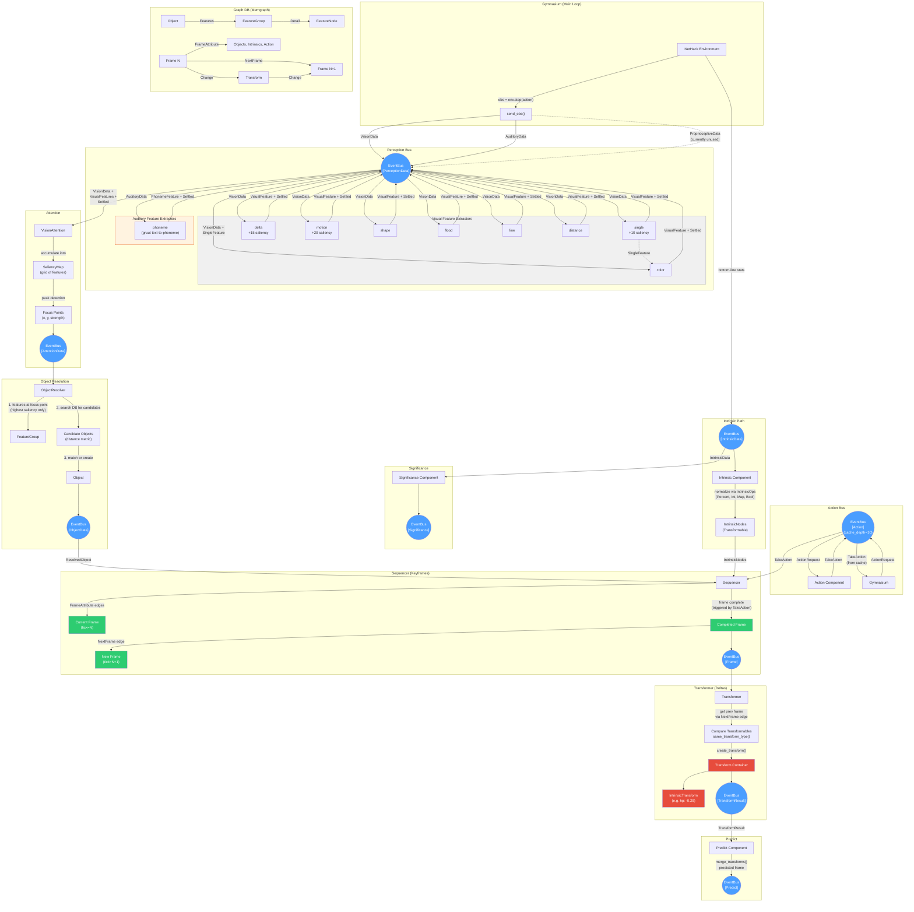

# ROC Data Flow: Perception through Deltas and Keyframes

**Color Key:**
- Blue circles -- EventBus channels (typed reactive streams)
- Green -- Keyframes (complete state snapshots)
- Red -- Deltas/Transforms (changes between frames)
- Gray box -- Visual feature extractors (process VisionData)
- Orange box -- Auditory feature extractors (process AuditoryData)

**Notes:**
- ProprioceptiveData is sent on the Perception bus but no component currently consumes it (dashed line)
- Color extractor depends on Single extractor output in addition to VisionData (dashed dependency)
- Action bus uses cache_depth=10 so Gymnasium can retrieve TakeAction responses
- CrossModalAttention is auto-loaded but incomplete (not shown)
- ObjectResolver currently only processes the single highest-saliency focus point
